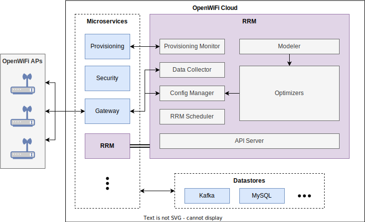

# Implementation
This document provides high-level implementation details for the RRM service.

## Overview

<p align="center">
  
</p>

## Framework

### Initialization
`Launcher` is the main class, exposing a command-line interface implemented
using [picocli]. The launcher creates *clients* and then passes them to the
`RRM` class to start all *modules* (details below). Typically, each module is an
event loop which runs in its own thread, implementing the Java `Runnable`
interface.

The service configuration is defined in the `RRMConfig` class, and can be
provided either via environment variables or as a JSON-serialized file. Default
values are used for any omitted fields. When using the static file option, any
new/missing fields are appended automatically. All fields are documented in
Javadoc.

### Data Structures
The device topology, `DeviceTopology`, is specified as groupings of APs into
disjoint "RF zones" (default `topology.json`). For example:
```json
{
  "<zone-name>": ["<serialNumber1>", "<serialNumber2>"],
  "building-A": ["aaaaaaaaaa01", "aaaaaaaaaa02"]
}
```

Device configuration is defined in `DeviceConfig` and applied in a layered
manner via `DeviceLayeredConfig` (default `device_config.json`), merging the
following layers from least to greatest precedence:
* Base/default AP config (`DeviceConfig.createDefault()`)
* Network-wide config (`networkConfig`)
* Per-zone config (`zoneConfig`)
* Per-AP config (`apConfig`)

`DeviceDataManager` wraps all operations for the device topology and device
configuration, and enables safe concurrent access.

### Logging
Logging is handled using [SLF4J]/[Log4j] and configured in
`src/main/resources/log4j.properties`. Output is written to console as well as
rotated log files.

### Versioning
The artifact version is defined in `pom.xml` and should match the OpenAPI
document version (see `ApiServer` annotations). During Maven builds, the version
string is written to `src/main/resources-filtered/version.txt`, and additional
metadata can also be appended via the property `appendVersionString`. During
runtime, version information can be accessed via `VersionProvider`.

## Clients
The *clients* implement connections to external services.

### uCentral OpenAPI
`UCentralClient` implements OpenAPI HTTP client calls to other uCentral services
(ex. [uCentralGw], [uCentralSec], [owprov]) using [Unirest]. Most request and
response schemas are defined in a corresponding "models" subpackage and are
serialized/deserialized as JSON using [Gson].

The client supports two modes:
* **Private endpoints:** When deployed in a cluster with other OpenWiFi
  services, private service URLs are learned from Kafka and requests are sent
  with API keys (i.e. `X-API-KEY` header).
* **Public endpoints:** Mainly for development purposes, public service URLs are
  learned from [uCentralSec] and requests are sent with a Bearer token (i.e.
  `Authorization` header) obtained via login using configured credentials.

### uCentral Kafka
`KafkaRunner` wraps the following [Apache Kafka] clients, handling the run loop
and graceful shutdown:
* `UCentralKafkaConsumer` implements the Kafka consumer for OpenWiFi topics, and
  passes data (ex. device state, wifi scan results, system endpoints) to other
  modules via listener interfaces.
* `UCentralKafkaProducer` implements the Kafka producer, which is responsible
  for periodically pushing system events required for discoverability by other
  OpenWiFi services.

### RRM Database
`DatabaseManager` handles JDBC connection details for the RRM database and
exposes methods for specific database operations. It uses the
[MySQL Connector/J] driver and [HikariCP] for connection pooling.

## Modules
The *modules* implement the service's application logic.

### Data Collector
`DataCollector` collects data from all OpenWiFi devices as follows:
* Issues WiFi scan commands periodically and handles responses
* Registers Kafka listeners to write records into the RRM database
* Registers config listeners to configure the stats interval in OpenWiFi devices
* Periodically queries capabilities for OpenWiFi devices

### Config Manager
`ConfigManager` sends config changes to OpenWiFi devices (via [uCentralGw]). Any
desired config changes are applied via listener interfaces, including the output
of RRM algorithms. Device config updates are either applied periodically (when
needed) or only triggered upon events (ex. RRM algorithm execution, API calls),
depending on RRM service configuration. To minimize polling frequency since
device config updates are rare, this thread has a long default sleep time and is
interrupted by other threads when a config update is needed.

`UCentralApConfiguration` wraps the raw device configuration JSON and provides
various access methods.

### Modeler
`Modeler` subscribes to raw uCentral data, then prepares it for use by an
optimizer. The "model" is defined in `DataModel` and includes the following
information for each device:
* Recent wifi scan results
* Statistics (or "state")
* Configuration (or "status")
* Capabilities

Additional data processing utilities are contained in `ModelerUtils`.

### API Server
`ApiServer` is an OpenAPI HTTP server written using [Spark], exposing the
following endpoints:
* `/` - Static resources from [Swagger UI] for visualizing and interacting with
  API endpoints
* `/openapi.{yaml,json}` - OpenAPI 3.0 document generated from source code using
  [Swagger Core]
* `/api/v1/<method>` - RRM API methods

The OpenWiFi SDK dictates several API endpoints which must be implemented by
every service, as well as endpoints specific to RRM providers. They are both
marked here under the "SDK" tag.

Depending on RRM service configuration, the API server may also enable CORS
selectively or globally, HTTP basic auth, and/or OpenWiFi auth (via Bearer
tokens or internal API keys).

### Provisioning Monitor
`ProvMonitor` syncs device topology ("venues") and configuration with the
OpenWiFi Provisioning service (when enabled).

### RRM Scheduler
`RRMScheduler` uses the [Quartz Job Scheduler] to schedule RRM algorithms to run
per zone with different intervals and parameters. The schedules are specified in
the device configuration as `RRMSchedule` and are applied only at the zone and
network layers.

## Optimizers
The *optimizers* implement the RRM algorithms, and are described in detail in
[ALGORITHMS.md](ALGORITHMS.md).

The `RRMAlgorithm` class provides a common entry point for all algorithm
invocations. The general logic is as follows:
* Identify the algorithm type (`AlgorithmType`), implementation class ("mode"),
  and any algorithm arguments
* Take the current data model snapshot from `Modeler` as input
* Compute the new device configs, then save and push them via `ConfigManager`


[picocli]: https://picocli.info/
[SLF4J]: http://www.slf4j.org/
[Log4j]: https://logging.apache.org/log4j/
[uCentralGw]: https://github.com/Telecominfraproject/wlan-cloud-ucentralgw
[uCentralSec]: https://github.com/Telecominfraproject/wlan-cloud-ucentralsec
[owprov]: https://github.com/Telecominfraproject/wlan-cloud-owprov
[Unirest]: https://github.com/kong/unirest-java
[Gson]: https://github.com/google/gson
[Apache Kafka]: https://kafka.apache.org/
[MySQL Connector/J]: https://dev.mysql.com/doc/connector-j/8.0/en/
[HikariCP]: https://github.com/brettwooldridge/HikariCP
[Spark]: https://sparkjava.com/
[Swagger UI]: https://swagger.io/tools/swagger-ui/
[Swagger Core]: https://github.com/swagger-api/swagger-core
[Quartz Job Scheduler]: https://www.quartz-scheduler.org/
